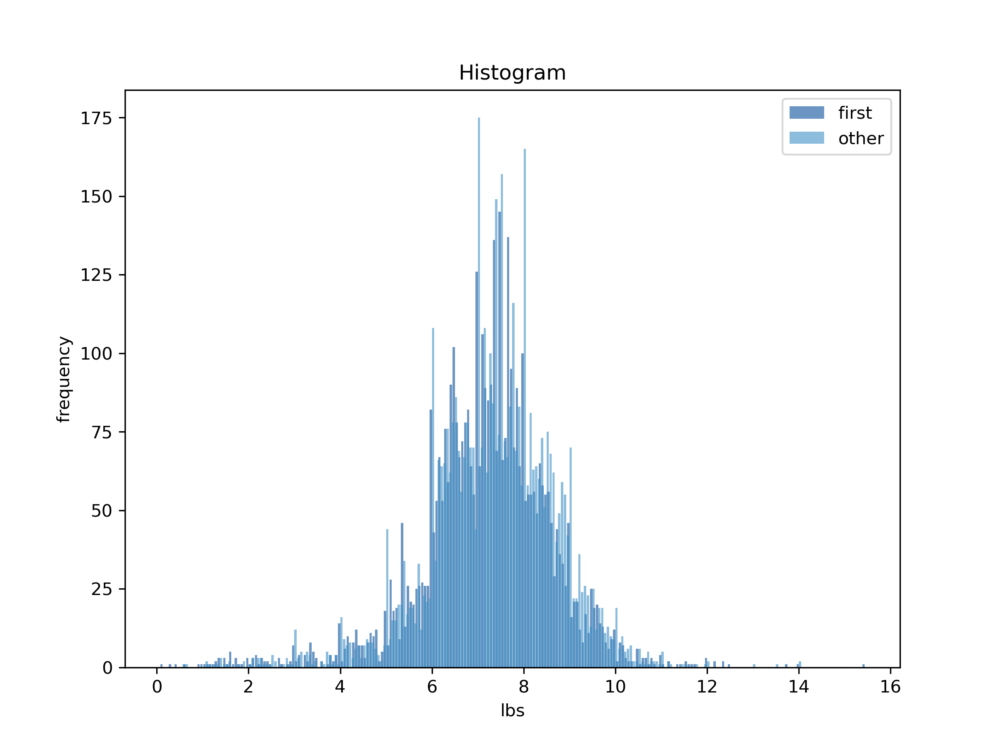

[Think Stats Chapter 2 Exercise 4](http://greenteapress.com/thinkstats2/html/thinkstats2003.html#toc24) (Cohen's d)

First babies have a mean weight of 7.201 lbs, other babies have a mean weight of 7.326 lbs, resulting in a mean difference of -0.125 lbs. With standard deviations of 1.421 and 1.394 lbs respectively, Cohen's *d* is -0.089. This, similarly to the difference in mean pregnancy length between first born babies and others, is insignificant. Hence it can be said that first born babies weigh the same as other babies. 

In order to determine this difference, I modified A. Downey's *first.py* program to use the variable `totalwgt_lb` instead of `prglngth`. The figure below shows a histogram of the total weights of first born babies as compared to others. By eye, there is no significant difference between the two distributions, which Cohen's *d* reflects. (Note, the colors aren't great for this plot, they are too similar. Looking in to the source code it looks like *thinkplot*'s colors are hardcoded, and I decided against changing them.)

