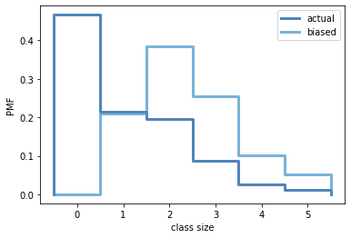

[Think Stats Chapter 3 Exercise 1](http://greenteapress.com/thinkstats2/html/thinkstats2004.html#toc31) (actual vs. biased)

**Problem: Class size paradox in the context of the number of kids per household.**

The problem was to investigate the class size paradox in the context of the number of kids per household. The number of actual kids in a household from the survey are given by the variable `numkdhh`. I grabbed the associated Pandas Series from the Pandas DataFrame, and then turned it into a PMF using the *thinkplot* code. I then took the same PMF and passed it though the `BiasPmf` method, as written by A. Downey, to transform the actual distribution into the biased one. Finally, I plotted the two PMFs together in order to compare them. (I did all of this within the python notebook `chap03ex.ipynb.`) The figure below shows the two distributions. The means of the actual and biased distributions are **1.02** and **2.40** kids per household respectively, which I found to be quite large. The associated code lies below the figure.





```
def BiasPmf(pmf, label):
    new_pmf = pmf.Copy(label=label)

    for x, p in pmf.Items():
        new_pmf.Mult(x, x)
        
    new_pmf.Normalize()
    return new_pmf
```


```
resp = nsfg.ReadFemResp()

num_kids_pmf_unbiased = thinkstats2.Pmf(resp.numkdhh, label='actual')
num_kids_pmf_biased = BiasPmf(num_kids_pmf_unbiased, label='biased')

thinkplot.PrePlot(2)
thinkplot.Pmfs([num_kids_pmf_unbiased, num_kids_pmf_biased])
thinkplot.Show(xlabel='class size',ylabel='PMF')

print('Unbiased mean', num_kids_pmf_unbiased.Mean())
print('Biased mean', num_kids_pmf_biased.Mean())
```
