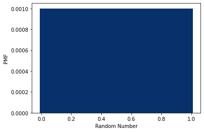
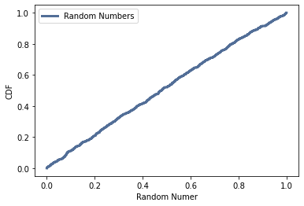
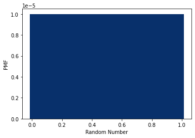
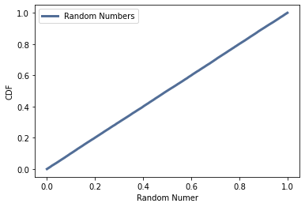

[Think Stats Chapter 4 Exercise 2](http://greenteapress.com/thinkstats2/html/thinkstats2005.html#toc41) (a random distribution)

**Problem: PMF and CDF of random numbers.**

The problem was to calculate the PMF and CDF of 1000 randomly generated numbers in the range [0,1), from the `numpy.random.random` method, and determine whether the distribution is uniform or not. From the distributions seen below, it appears so, though the CDF distribution isn't quite a straight line.


PMF             |  CDF
:-------------------------:|:-------------------------:
  |  


Constructing the same distributions for 100,000 random numbers instead, the CDF becomes a straight line and the distribution can be seen to be uniform. (From the problem text in the ipynb, it's insinuated that the distribution is non-uniform and something should be wrong with the PMF. I'm not sure if I've missed something here or not. Perhaps there is a deficiency in the random number generator, or perhaps the problem is getting at the need to randomly sample more times as I've done.)


PMF             |  CDF
:-------------------------:|:-------------------------:
  |  


The associated code is given below:

```
thousand = np.random.random(1000)

thousand_pmf = thinkstats2.Pmf(thousand)#, label='Thousand Random Numbers')
thinkplot.Hist(thousand_pmf, align='center', width=width)
thinkplot.Config(xlabel='Random Number', ylabel='PMF')

thousand_cdf = thinkstats2.Cdf(thousand, label='Random Numbers')
thinkplot.Cdf(thousand_cdf)
thinkplot.Config(xlabel='Random Numer', ylabel='CDF', loc='upper left')
```
