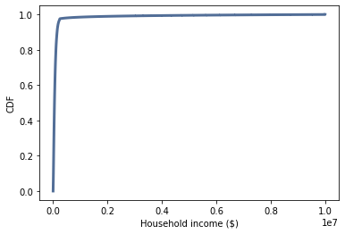

[Think Stats Chapter 6 Exercise 1](http://greenteapress.com/thinkstats2/html/thinkstats2007.html#toc60) (household income)

**Problem: Skewedness of the distribution of income.**


The question provides income data among households in the US, and then asks the reader to calculate the mean, median, skewedness, and Pearson's skewedness of a sample of the data. A method called `InterpolateSample` along with some other code is provided by A. Downey to read in the data and plot the CDFs of the household incomes, in both log and normal format, seen below. The generated sample can then be passed to the associated methods to calculate the quantities of interest. The table below the figure gives the quantities for the sample with an assumed upper bound of $1M.


CDF of log incomes             |  CDF of incomes
:-------------------------:|:-------------------------:
  |  


Quantity             |  Value
:-------------------------:|:-------------------------:
Mean  |  $74,278
Median | $51,226
Probability below mean | 66.0%
Skewedness | 4.95
Pearson's Skewedness | 0.74


If instead the assumed upper bound is $10M instead of $1M, then the CDFs, the mean, the probability below the mean, and the skewedness fo the distributions all change dramatically. Only the median is unchanged. The associated figures and table of relevant quantities are included below. Note that the skewedness quantity increases, while Pearson's skewedness quantity decreases, since it is less susceptible to outliers, including the upper bound of $10M.


CDF of log incomes             |  CDF of incomes
:-------------------------:|:-------------------------:
  |  


Quantity             |  Value
:-------------------------:|:-------------------------:
Mean  |  $124,267
Median | $51,226
Probability below mean | 85.7%
Skewedness | 11.60
Pearson's Skewedness | 0.39


Associated problem code:


```
def InterpolateSample(df, log_upper=6.0):
    """Makes a sample of log10 household income.

    Assumes that log10 income is uniform in each range.

    df: DataFrame with columns income and freq
    log_upper: log10 of the assumed upper bound for the highest range

    returns: NumPy array of log10 household income
    """
    # compute the log10 of the upper bound for each range
    df['log_upper'] = np.log10(df.income)

    # get the lower bounds by shifting the upper bound and filling in
    # the first element
    df['log_lower'] = df.log_upper.shift(1)
    df.loc[0, 'log_lower'] = 3.0

    # plug in a value for the unknown upper bound of the highest range
    df.loc[41, 'log_upper'] = log_upper
    
    # use the freq column to generate the right number of values in
    # each range
    arrays = []
    for _, row in df.iterrows():
        vals = np.linspace(row.log_lower, row.log_upper, int(row.freq))
        arrays.append(vals)

    # collect the arrays into a single sample
    log_sample = np.concatenate(arrays)
    return log_sample


import hinc
income_df = hinc.ReadData()

log_sample = InterpolateSample(income_df, log_upper=6.0)

log_cdf = thinkstats2.Cdf(log_sample)
thinkplot.Cdf(log_cdf)
thinkplot.Config(xlabel='Household income (log $)',
               ylabel='CDF')


sample = np.power(10, log_sample)

cdf = thinkstats2.Cdf(sample)
thinkplot.Cdf(cdf)
thinkplot.Config(xlabel='Household income ($)',
               ylabel='CDF')

Mean(sample), Median(sample)
cdf.Prob(Mean(sample))               
Skewness(sample), PearsonMedianSkewness(sample)
```
