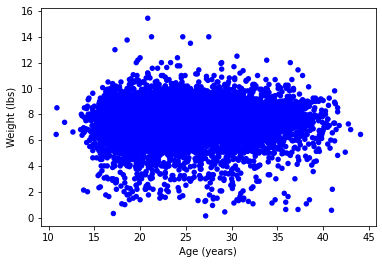
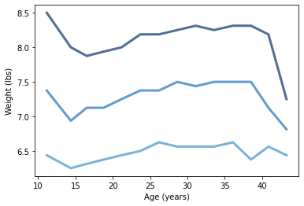

[Think Stats Chapter 7 Exercise 1](http://greenteapress.com/thinkstats2/html/thinkstats2008.html#toc70) (weight vs. age)

**Problem: Investigate the correlation between birth weight and the mother's age.**

I made a scatter plot of the birth weight of live babies versus the age of the mother, which is shown in the left figure below. As seen there appears to be very little correlation. Calculating the correlation and Spearman's correlation, they come out to values of **0.069** and **0.095** respectively. Both of these are very small, reflecting the fact that there is very little to no correlation between the two quantities. 

Also included is a plot of the 25, 50, and 75 percentiles for birth weight versus mothers age, for the data binned into 2.5 year bins. The percentiles show a somewhat linear rise over the range 15--35 years, though it's not perfectly linear. (The points on the outside rise and fall respectively due to less stats in those bins.) The non-linear nature of the percentiles plot shows a likely cause for the difference between the two correlation coefficients.


Scatter Plot             |  Percentile Plot
:-------------------------:|:-------------------------:
  |  


```
import first

live, firsts, others = first.MakeFrames()
live = live.dropna(subset=['agepreg', 'totalwgt_lb'])


b_weights, ages = live.totalwgt_lb, live.agepreg

thinkplot.Scatter(ages, b_weights, alpha=1)
thinkplot.Config(xlabel='Age (years)',
                 ylabel='Weight (lbs)')


bins = np.arange(10, 45, 2.5)
indices = np.digitize(live.agepreg, bins)
groups = live.groupby(indices)

mean_ages = [group.agepreg.mean() for i, group in groups]
cdfs = [thinkstats2.Cdf(group.totalwgt_lb) for i, group in groups]

for percent in [75, 50, 25]:
    weight_percentiles = [cdf.Percentile(percent) for cdf in cdfs]
    label = '%dth' % percent
    thinkplot.Plot(mean_ages, weight_percentiles, label=label)
    
thinkplot.Config(xlabel='Age (years)',
                 ylabel='Weight (lbs)')


Corr(b_weights, ages)
SpearmanCorr(b_weights, ages)


```
